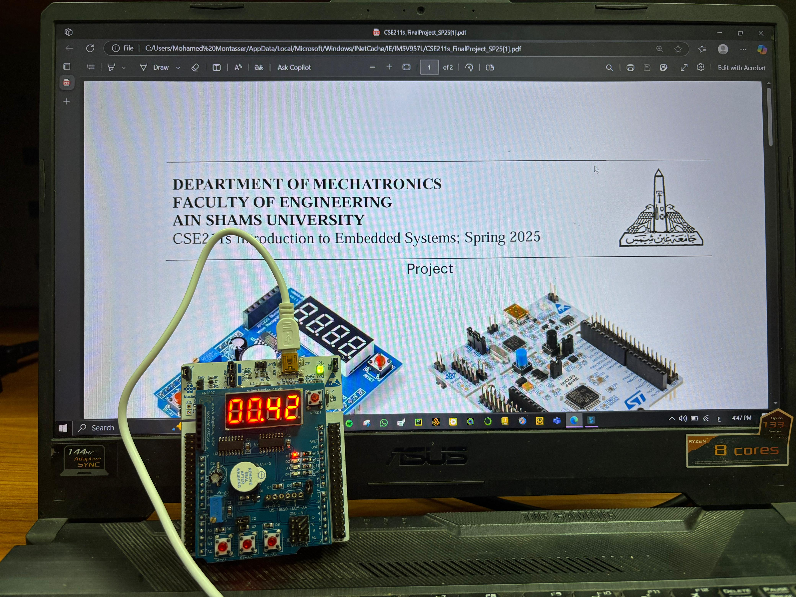

# NUCLEO-F401RE Multifunction Shield – RTC & Voltage Display

## 📌 Project Overview

This project is part of the **CSE211s – Introduction to Embedded Systems (Spring 2025)** course at Ain Shams University.  
It showcases a real-time clock (RTC) and analog voltage display using the **NUCLEO-F401RE** board and the **Arduino Multifunction Shield**

---

## ⚙️ Features

- ⏱ **Real-Time Clock (RTC)**
  - Displays time (MM:SS) on a 4-digit 7-segment display.
  - Timer starts from 00:00 on power-up.
  - Pressing **Switch S1** resets the timer to zero.

- 🔋 **Analog Voltage Display**
  - Reads voltage from the onboard potentiometer using the NUCLEO's ADC.
  - Pressing **Switch S3** displays the current voltage (in volts) on the 7-segment display.
  - Releasing S3 returns to displaying time.
  - The RTC continues running in the background.

---

## 🧰 Hardware Used

- [NUCLEO-F401RE Development Board](https://www.st.com/en/evaluation-tools/nucleo-f401re.html)
- Arduino Multifunction Shield with:
  - 4-digit 7-segment display
  - Onboard potentiometer
  - Tactile push buttons (S1, S2, S3)

---

## 🚀 How It Works

- **Startup Code:** Initializes the system clock, GPIOs, ADC, and timers.
- **Main Loop:** 
  - Updates the 7-segment display with current time or voltage.
  - Polls button states to determine display mode.
- **Interrupt Service Routines (ISRs):**
  - Timer ISR updates the time counters every second.
  - External interrupts (if used) handle button presses cleanly.

---

## 📽 Demo Video

Watch the full system in action here:  
📺 [YouTube Demo – NUCLEO RTC & Voltage Display](https://youtu.be/23day6YDwYg)

---

## 🧠 Learning Objectives

- Configure and use ADC in embedded systems
- Interface and multiplex a 4-digit 7-segment display
- Handle multiple button inputs
- Manage real-time tasks with timers and ISRs

---

## 👨‍💻 Authors

**Team Members:**  
- Adham Ehab Saleh (2100679)  
- Omar Mohamed Fathy (2100503)  
- Mohamed Montasser Abdelwahab (2100543)

**Course Instructor:**  
- Dr. Mohamed H. El-Shafey  
- Faculty of Engineering, Ain Shams University


## NUCLEO-F401RE Multifunction Shield – RTC & Voltage Display Mbed OS example

The example project is part of the [Arm Mbed OS Official Examples](https://os.mbed.com/code/) and is the [getting started example for Mbed OS](https://os.mbed.com/docs/mbed-os/latest/quick-start/index.html). It contains an application that repeatedly blinks an LED on supported [Mbed boards](https://os.mbed.com/platforms/).

You can build the project with all supported [Mbed OS build tools](https://os.mbed.com/docs/mbed-os/latest/tools/index.html). However, this example project specifically refers to the command-line interface tools, [Arm Mbed CLI 1](https://github.com/ARMmbed/mbed-cli#installing-mbed-cli) and [Mbed CLI 2](https://github.com/ARMmbed/mbed-tools#installation).

(Note: To see a rendered example you can import into the Arm Online Compiler, please see our [import quick start](https://os.mbed.com/docs/mbed-os/latest/quick-start/online-with-the-online-compiler.html#importing-the-code).)

## Mbed OS build tools

### Mbed CLI 2
Starting with version 6.5, Mbed OS uses Mbed CLI 2. It uses Ninja as a build system, and CMake to generate the build environment and manage the build process in a compiler-independent manner. If you are working with Mbed OS version prior to 6.5 then check the section [Mbed CLI 1](#mbed-cli-1).
1. [Install Mbed CLI 2](https://os.mbed.com/docs/mbed-os/latest/build-tools/install-or-upgrade.html).
1. From the command-line, import the example: `mbed-tools import mbed-os-example-blinky`
1. Change the current directory to where the project was imported.

### Mbed CLI 1
1. [Install Mbed CLI 1](https://os.mbed.com/docs/mbed-os/latest/quick-start/offline-with-mbed-cli.html).
1. From the command-line, import the example: `mbed import mbed-os-example-blinky`
1. Change the current directory to where the project was imported.

## Application functionality

The `main()` function is the single thread in the application. It toggles the state of a digital output connected to an LED on the board.

**Note**: This example requires a target with RTOS support, i.e. one with `rtos` declared in `supported_application_profiles` in `targets/targets.json` in [mbed-os](https://github.com/ARMmbed/mbed-os). For non-RTOS targets (usually with small memory sizes), please use [mbed-os-example-blinky-baremetal](https://github.com/ARMmbed/mbed-os-example-blinky-baremetal) instead.

## Building and running

1. Connect a USB cable between the USB port on the board and the host computer.
1. Run the following command to build the example project and program the microcontroller flash memory:

    * Mbed CLI 2

    ```bash
    $ mbed-tools compile -m <TARGET> -t <TOOLCHAIN> --flash
    ```

    * Mbed CLI 1

    ```bash
    $ mbed compile -m <TARGET> -t <TOOLCHAIN> --flash
    ```

Your PC may take a few minutes to compile your code.

The binary is located at:
* **Mbed CLI 2** - `./cmake_build/<TARGET>/develop/<TOOLCHAIN>/mbed-os-example-blinky.bin`
* **Mbed CLI 1** - `./BUILD/<TARGET>/<TOOLCHAIN>/mbed-os-example-blinky.bin`

Alternatively, you can manually copy the binary to the board, which you mount on the host computer over USB.

## Expected output
The LED on your target turns on and off every 500 milliseconds.


## Troubleshooting
If you have problems, you can review the [documentation](https://os.mbed.com/docs/latest/tutorials/debugging.html) for suggestions on what could be wrong and how to fix it.

## Related Links

* [Mbed OS Stats API](https://os.mbed.com/docs/latest/apis/mbed-statistics.html).
* [Mbed OS Configuration](https://os.mbed.com/docs/latest/reference/configuration.html).
* [Mbed OS Serial Communication](https://os.mbed.com/docs/latest/tutorials/serial-communication.html).
* [Mbed OS bare metal](https://os.mbed.com/docs/mbed-os/latest/reference/mbed-os-bare-metal.html).
* [Mbed boards](https://os.mbed.com/platforms/).

### License and contributions

The software is provided under Apache-2.0 license. Contributions to this project are accepted under the same license. Please see [CONTRIBUTING.md](./CONTRIBUTING.md) for more info.

This project contains code from other projects. The original license text is included in those source files. They must comply with our license guide.
